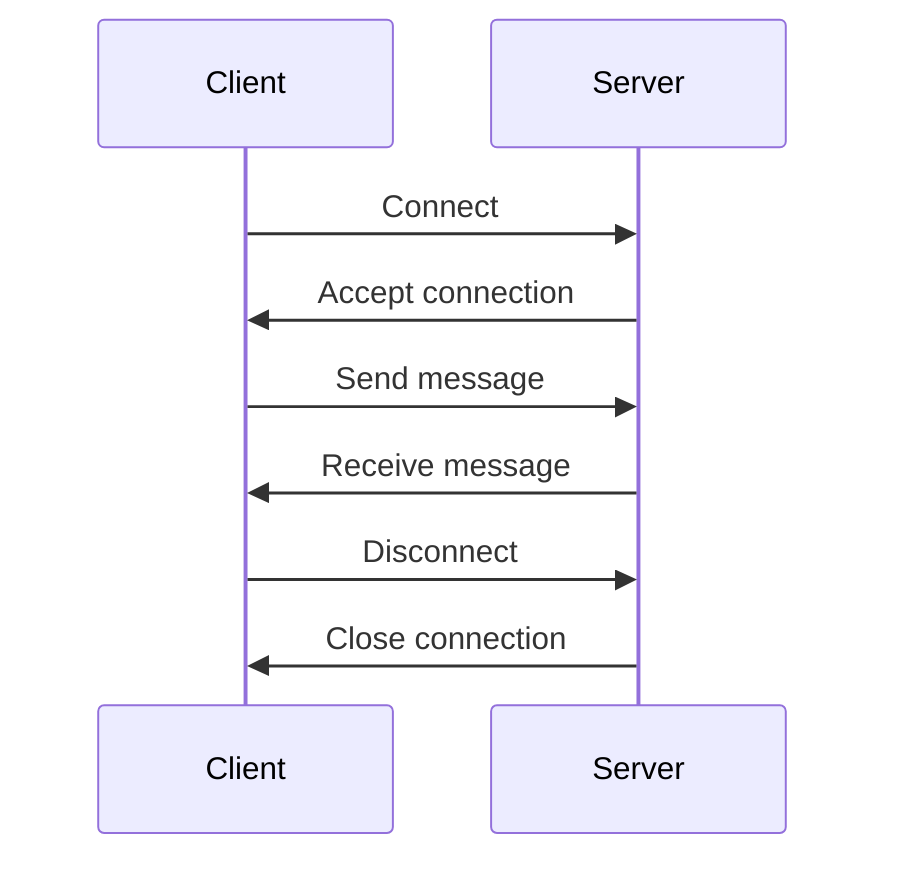

## Learning Websockets

This project is a simple Connect Four game that uses websockets to allow two players to play against each other.
I am following the tutorial at https://websockets.readthedocs.io/en/stable/tutorial/index.html to build this project.

## What is websockets?

Websockets is a protocol that allows full-duplex communication between a client and a server over a single, long-lived connection. Unlike HTTP, which is request-response based, websockets allow both the client and the server to send messages at any time.

### How does websocket work?

1. The Client establishes a connection with the server
2. The Server accepts the connection
3. The Client sends a message to the Server
4. The Server receives the message
5. The Client disconnects from the Server
6. The Server closes the connection

